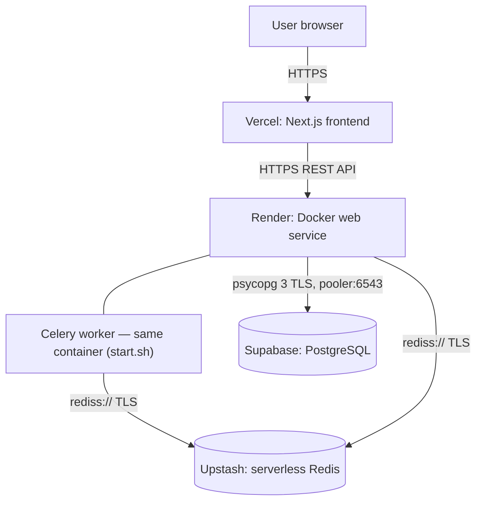
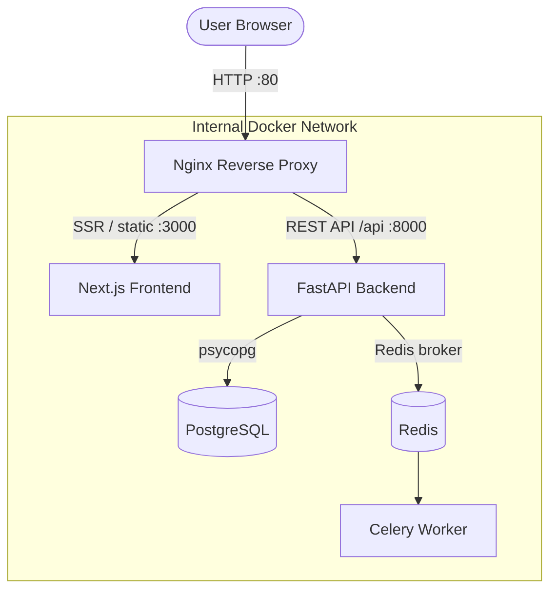
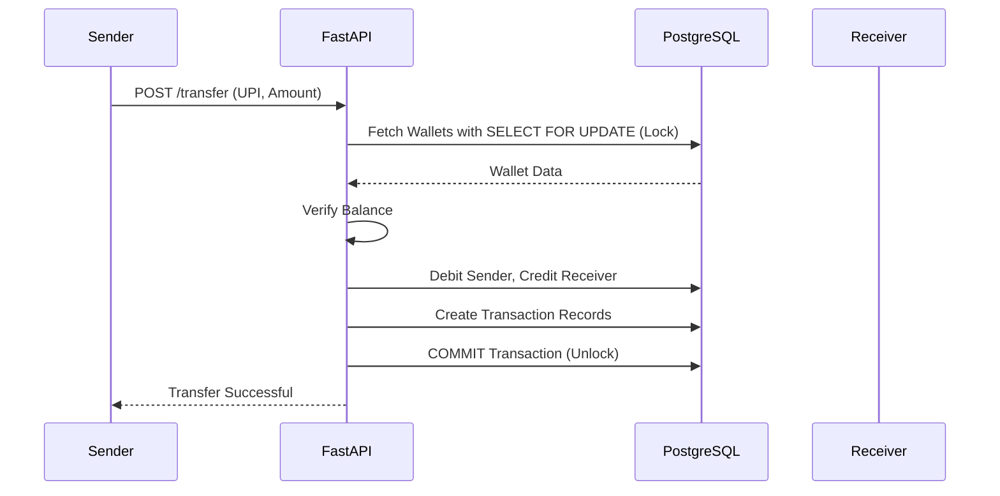

# Digital Payment Wallet

A highly scalable, asynchronous digital wallet application that supports secure peer-to-peer (P2P) transfers, user authentication, and deposit management. Built with FastAPI, PostgreSQL, and a Next.js (React) frontend, this app ensures safe financial transactions using strict row-level locking strategies to prevent race conditions and deadlocks.

## Screenshots

<!-- Add your screenshots to a folder named "assets" in the repository, then replace these placeholder images! -->

| Login & Registration | Interactive Dashboard |
|:---:|:---:|
|  |  |

| P2P Transfer & Add Funds | Transaction History |
|:---:|:---:|
|  |  |

## System Architecture

**Production** runs on a zero-cost managed stack with GitHub-driven continuous
deployment (see [`DEPLOYMENT.md`](DEPLOYMENT.md)):



**Local development** uses the Docker Compose stack — Nginx fronts the Next.js
frontend on `/` and the FastAPI backend on `/api`, with Postgres, Redis, and a
Celery worker as sibling containers:



### Safe Financial Concurrency
To safely handle hundreds of simultaneous money transfers without double-spending, the database enforces ACID compliance using strict row-level locking during transfers.



## Features
- **User Authentication:** Secure JWT-based login and registration (Bcrypt password hashing).
- **UPI-Style Discovery:** Discover receivers safely using a `username@wallet` style ID without exposing personal data.
- **Deadlock-Free P2P Transfers:** Guaranteed safe concurrent transactions via deterministic database locking.
- **Cursor Pagination:** High-performance Keyset pagination for infinite-scroll transaction histories.
- **Service-Oriented Architecture:** Includes Redis and Celery for asynchronous background task processing.
- **Containerized local dev:** Full stack via Docker Compose behind Nginx.
- **Distributed free-tier deploy:** Vercel + Render + Supabase + Upstash, CI/CD from GitHub.

## Tech Stack
- **Backend:** FastAPI, Python 3.12, SQLAlchemy 2.0, psycopg 3 (async), Celery
- **Database / Cache:** PostgreSQL 15, Redis
- **Frontend:** Next.js 14 (App Router), React 18, TypeScript, Tailwind CSS
- **Local infra:** Docker, Nginx
- **Hosting:** Vercel (frontend), Render (API + worker in one Docker service), Supabase (Postgres), Upstash (Redis)

## Local Setup

### With Docker (full stack)
1. Clone the repository.
2. Run `docker compose up -d --build`.
3. Open the app at `http://localhost` (Nginx serves the frontend on `/` and the API on `/api`).
4. The API (with Swagger Docs) is at `http://localhost:8000/docs`.

### Frontend only (development)
```bash
cd frontend
cp .env.example .env.local   # optional; defaults work against a local API on :8000
npm install
npm run dev                  # http://localhost:3000
```
The dev server proxies `/api/*` to `API_PROXY_TARGET` (default `http://localhost:8000`).

## Deployment
Production is a zero-cost managed stack (Vercel, Render, Supabase, Upstash) with
continuous deployment from GitHub. Full step-by-step instructions:
[`DEPLOYMENT.md`](DEPLOYMENT.md).

- Backend config is entirely environment-driven — `DATABASE_URL`, `REDIS_URL`,
  `FRONTEND_ORIGINS`, `SECRET_KEY` (see [`app/core/config.py`](app/core/config.py)
  and [`.env.example`](.env.example)).
- The root `Dockerfile` + `start.sh` run the API and Celery worker (solo pool)
  in one free Render Web Service, with `SIGTERM` handling for clean shutdowns.
- `render.yaml` is the Render Blueprint.
